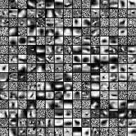
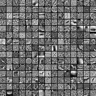
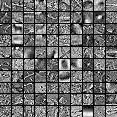
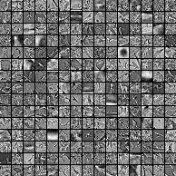
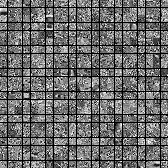

#k-Means

##Problem 30

The file "kmeans.py" contains my implemntation of k-Means according to the mentioned paper. It can be tested by the method "run_kmeans(dataset='cifar-10-python.tar.gz', n_centroids=225, e_zka=0.01, e_norm=10, max_iter=10, n_samples=10000)":

dataset: specifies the dataset
n_centroids: number of controids used during the k-means algorithm
e_zka: epsilon for the data whitening
e_norm: epsion for the data normalization
max_iter: the number of iterations performed during k-means
n_samples: the number of samples, which are used for the k-means.
grayscale_and_resize: Flag with activates transforming the imput data to grayscale and resizing it. 

##Problem 31:
If the flag "grayscale_and_resize" is True, the CIFAR pictured are transformed to grayscale and resized from 32 x 32 to 12 x 12 pixels before the training.

###Whitening
The following plots demonstrate the benefit of the whitening step. The left plot shows the respective fields of a 225 centroids k-means run without whitening, the right one with whitening.

  
  

Is gets visible that whiting has an enormous effect and leads to significantly sharper shapes in the respective fields. In some weight pots it is even possible to recognize the respective class of the picture.

###Number of centroids
A core parameter of k-means is the number of centroids. In the following, executions with different number of centroids are compared. The next plot shows the respective fields of executions with 100 (left), 225 (middle) and 484 (right) centroids.

  
  
  

It is interesting that most of the centroids of the left plot can also be found in the other two plot. This can be interpreted that k-means with less centroids focuses on the most dominant features. With increasing number of centroids, also other features are included.

