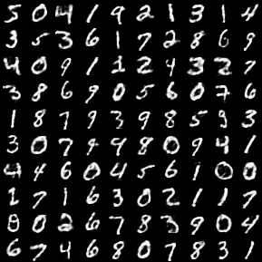

#PCA and sparse Autoencoder
##Problem 20

The file "pca.py" contains an implementation of pca. The actual pca is done in the method doPCA(data, n_components=2). Data is an array with the for the PCA, n_components is the number of eigenvectors, which should be returned. the returned array can be used to truncate orginal data.

##Problem 21
The method doPCAScatterplot(dataset='mnist.pkl.gz', n_samples=30000) performs the scatterplot. dataset specifies with 'mnist.pkl.gz' or 'cifar-10-python.tar.gz' the dataset, n_samples the number of randomly select samples for the plot. The current implementation generates the covariance matrix and calculates its eigenvectors by numpy routines. Since this implies operations on an dimension*dimension matrix, the execution is especially for the CIFAR-10 data (dimension=3072) very expensive. A possible optimization approach would be to calculate only the n_components first eigenvectors.
The files 'scatterplotMNIST.png' and 'scatterplotCIFAR.png' contain the respective plots for the MNIST and CIFAR-10 datsets.

  
  

For MNIST (left plot) the data looks close the linear seperable. Especially for class 1. For the CIFAR-10 dataset (right plot), the first two pca dimension do not suffice to separate the data.

##Problem 22
dA.py contains an implementation of an autoencoder with squared error loss on the MNIST dataset using theano and climin. A autoencoder can be started by the method run_dA(learning_rate=0.1, n_epochs=5, optimizer='gd', n_hidden=500, dataset='mnist.pkl.gz', batch_size=20,n_in = 28 * 28, corruption=0.0).

learning_rate: learning rate, for gradient descent
n_epochs: number of epochs during encoding
optimizer: optimizer, "gd" or "rmsprop"
n_hidden: number of hidden neurons
dataset: filename of the dataset. If the dataset is not present is is downloaded in the folder ../data/. This folder must exist.
batch_size: Batch size
n_in: Number of visible neurons (input and output dimension)
corruption: degree of corruption

Suitable imputs for training the model are 100 hidden units, a batch size of 20, corruption of 0.3 and 5-10 epochs during optimization. More detailled information about training the network is included in the next problem.

##Problem 23
L1 penalty was added to the loss function The method run_dA(..) has now an additional parameter "l1_penalty", which regulates the degree of the penalty (analogous to the hpyerparameter lambda in the problem description). All following plots are in the subfolder "filters autoencoder".

###Corruption
The following plots contain the plots of the respective fields with no corruption (left) and corruption with factor 0.3 (right).

  
  

Generally, the respective fields look quite similar. However, in the pictures with corruption the dark parts in the weights are smaller. In this case, single neurons focus on smaller features in the data. Also, it can be observed that corruption reduces the background noise in the respective fields.

###L1-penalty
Introducing L1 penalties leads to great results. By forcing most of the hidden units to be close zero, the information about input data is concentrated in only a few nodes. As a consequence the weights of the inner nodes become more and more similar to concrete data.
Following picture contains the respective fields of an autoencoder with 100 hidden units, 0.3 corruption and 0.3 L1 penalty.

  

Increasing the l1_penalty factor to 0.6 leads to a even stronger compression. Due to the strong penalty, some nodes do not represent any feature at all but weight that minimize their value best for all datasets. Here even less neurons than given are used to represent the data.

  

###Number of hidden nodes
Increasing the number of hidden units yields similar phenomenon than above. With 1600 hidden units and L1 penalties, not all hidden neurons are used to represent the data. The majority of the neurons have similar weights that minimize the value of the neuron. Examples with l1_penalty=0.3 (first) and l1_penalty=0.6 (second) are given here. As a consequence of the stronger penalty, the second run uses less neurons for feature representation.

  
   
  

##Problem 24

The the following are the reconstructions of the first 100 samples of an autoencoder with 1600 hidden neurons, corruption of 0.3 and L1 penalty of 0.0 (left), 0,3 (middle) and 0,6 (right). The plots are saved in the subfolder "reconstructions autoencoder".

  
  
  

With increasing value of L1 penalty factor (lambda), the reconstruction get more and more blurred. The reason of this phenomenon lies again in the compression of feature information to only a few inner neuron, which was already described above. Without penalty, the input features can be represented by 1600 hidden neurons easily. With growing L1 penalty, the network has balance between the reconstruction error and the values in the inner neurons.

Additionally, the file autoencoderrec.png contains a reconstruction of a network with 0.3 corruption, L1 penalty factor 0.3 but only 100 inner neurons. It gives evidence that the NMIST data  contains heavliy redundant dimensions. The data could be reconstructed greatly from only 100 inner neurons:

  

##Problem 25

the file "autoencoderfilter.png" contains the receptive fields of an execution with 100 inner neurons, rmsprop optimization, corruption of 0.3 and L1_penalty of 0.3. More prints of receptive fields have already been mentioned in Problem 23.

"autoencoderfilter.png":

  

##Problem 26
Sparse encoding of MNIST means that single pictures are represented by only a few or (in the extreme case) one neurons with strong activations. In this case the inner neurons all corresponde to one class of the MNIST data. This is visible above in the plots of respecitve fields with L1 penalty, which are quite similar to concrete numbers (0-9).