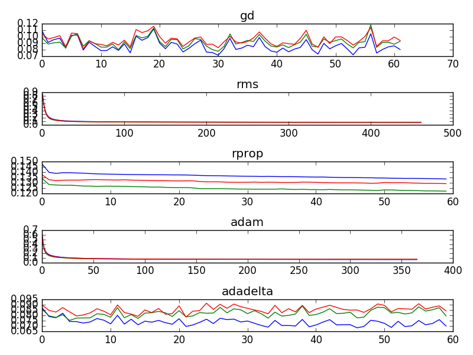

#Logistic Regression

##Problem 8:

The file logreg.py contains the implementation of logistic regression for the MNIST dataset using standard gradient descent with minibatches. The implementation uses Theano and Climin.
The method "def sgd_optimization_mnist(learning_rate=0.13, n_epochs=1000, dataset='mnist.pkl.gz', batch_size=600, optimizer='gd'):" starts a run of logistic regression for the mnist data.

To run successfully the folder ../data/ has to exist. During the first execution, the MNIST dataset is downloaded in this folder.

##Problem 9:
In the implementation of the previous problem some parameters can be defined. Examples are the batch_size and the learning rate. Varying them leads to different result.

###Learning rate
The file "learning_rate_1.png" shows the archieved test error for different error rates. The batch size was fixed to 600 in this measurement. This first measure states an optimal learning rate in the interval [0.5,1.0]. A second experiment with smaller step size analyses this circumstance more detailled. The conrete results are displayed in the file "learning_rate_2.png" (the legend is incorrect labeled and should read "test error"). The results of this measurement with step sized between [0.5,1.0] return an optimal learning rate of 0.55. With this value a validation error of 8.06% and a test error of 8.29% could be archieved. 

  

###Batch size
There seems to be no strong correlation between the batch size and the test error. Runs with different batch sizes showed no variations except random variation due to the use of random batches. Results are given in the following table:

| Batch size | best validation score | test error|
|------------|-----------------------|-----------|
| 400        | 8.280000 %            | 8.020000 %|
| 500        | 8.020000 %            | 8.450000 %|
| 600        | 7.940000 %            | 8.370000 %|
| 700        | 7.750000 %            | 8.060000 %|
| 800        | 7.740000 %            | 8.330000 %|

###Random variance due to random batches
The file "Varying_with_same_parameter.png" displays the variation of different execution with the same parameteres (here: batch size 600, learning rate 0.55). It gives evidence that measures with different parameters have to be analysed with caution since the test errors of to executions with equal parameters can differ up to almost 10% relatively (9.6% vs. 8.55%).

  

###Training without batches
Without minibatches the results are a lot better, since all of the available data is used in every optimization step. In my implementation this can be started by calling the start function with the parameter "batch_size=None". In such a run a test performance of 7.48 % could be archieved. Considering this in combination with the variances described before, an implementation without minibatches is a good alternative, if the training data is completely available in advance and not to big.

###Execution time
On my laptop (Intel® Core™ i5-4210M CPU @ 2.60GHz × 4) the linear regression ran with approximately 1,85 epochs per second.

The execution time depends strongly on the number of epochs and therefore on the stopping criterion. Depending on how often the early stopping variable "patience" is increased during the implemenation, one run takes between 60 and 180 epochs. 60 epochs corresponds with the minimal number of optimization iterations of 5000 (~ 60 epochs * 83 minibatches per epoch). 180 epochs corresponds to approximately three increasing steps of the patience due to a significant enough optimization within one step.

Since smaller learning rates during the gradient descent lead to smaller and steadier optimization steps, they usually increase the patience less often. Beeing equally accurate compared to bigger learning rates, they need less computation effort and are therefore more efficient.

##Problem 10:

In the implementation, the optimizer is specified by the argument "optimizer=[..]" of the method sgd_optimization_mnist. By this way, different optimizers of climin can be tried out.

The following table yields the results with different minimization methods of climin. Best results delivered rmsprop and adam.

| Minimization method | best validation score | test performance |
|---------------------|-----------------------|------------------|
| gd                  | 7.910000 %            | 8.400000 %       |
| rmsprop             | 6.760000 %            | 7.290000 %       |
| rprop               | 11.700000 %           | 12.160000 %      |
| adam                | 6.670000 %            | 7.250000 %       |
| adadelta            | 7.530000 %            | 8.270000         |

##Problem 11:

The final weights for gradient descent are visualized in the file repflds.png. The results of minimization with adam are in repflds_adam.png. In that concrete run a test error of 7.200000 % could be reached. It is also visible in the plots of the respective fields, that logistic regression with adam optimization worked better than wich gradient descent. Whereas the representations of the run with gradient descent is more patchy, the weights of adam minimization appear more clearer an brighter. Appearently, with this method the weights could be better adjusted to the important dimensions of the MNIST data. 

Respective fields of gd (left) and adam (right):

  
  

##Problem 12:
The error courves of gd, rmsprop, rprop, adam and adadelta are compared in the plot errors_comparison.png. Whereas the plot is too small to give quantitative error rates, it gives a good overview about the general shape of error courves and expected number of epochs.

errors_comparison:

  

More detailled information is displayed in the files error_gd.png, error_adam.png, error_rmsprop.png, error_rprop.png and error_adadelta.png.

gd:

  

adam:

  

rmsprop:

  

rprop:

  

adadelta:

  

The implementation uses early stopping. Minimization is done as long as significant improvements of the validation errors are archieved. A significant improvement is an minimzation, which improves the currently best validation loss with at least 5%. Concrete this means, that each time, significant improvement of the validation loss was found, the maximal number of minibatches (called "patience" is the implementation) is adjusted, so that the same number of minibatch optimization, which has already been performed, will be performed again.

##Problem 13:
It is obvious that adjusting the data leads to better classification results. In the most extreme case, all training data has become equal so that the classifier would work 100% correctly. Transforming data manually is bad scientific practice because yields no usable outcome. the aim in machine learning is to work on broad range of real world data  and not just for an handpicked set of special data. Instead of adjusting the problem (which is done when data is adjusted), it makes more sense to optimize the algorithm or explore different solution approaches. 

