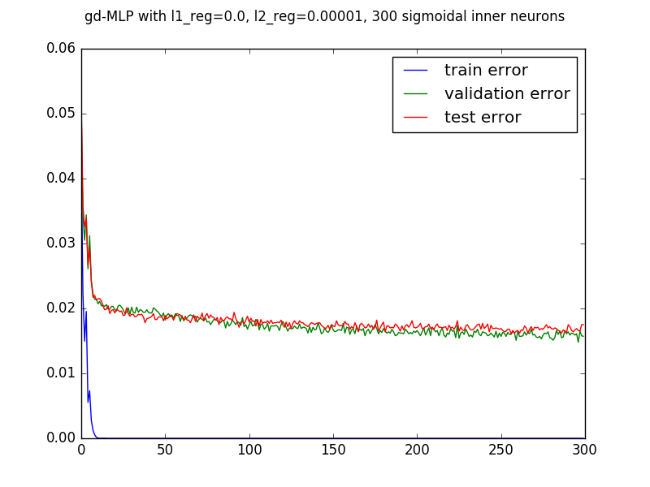
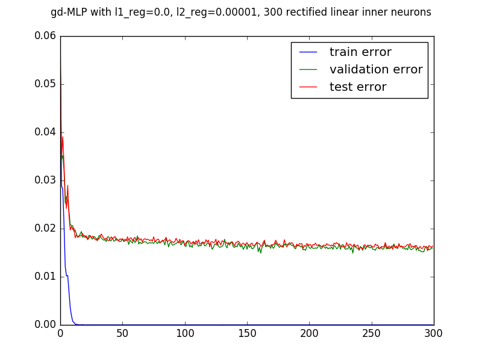
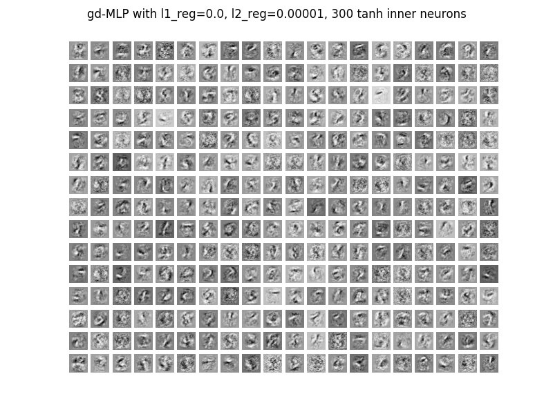
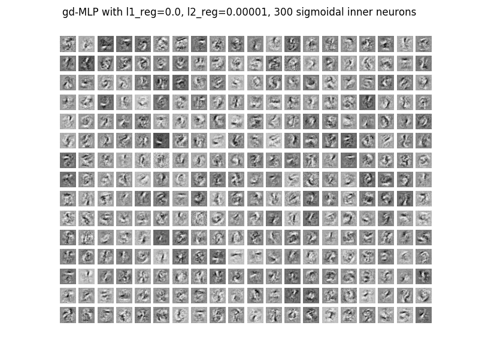
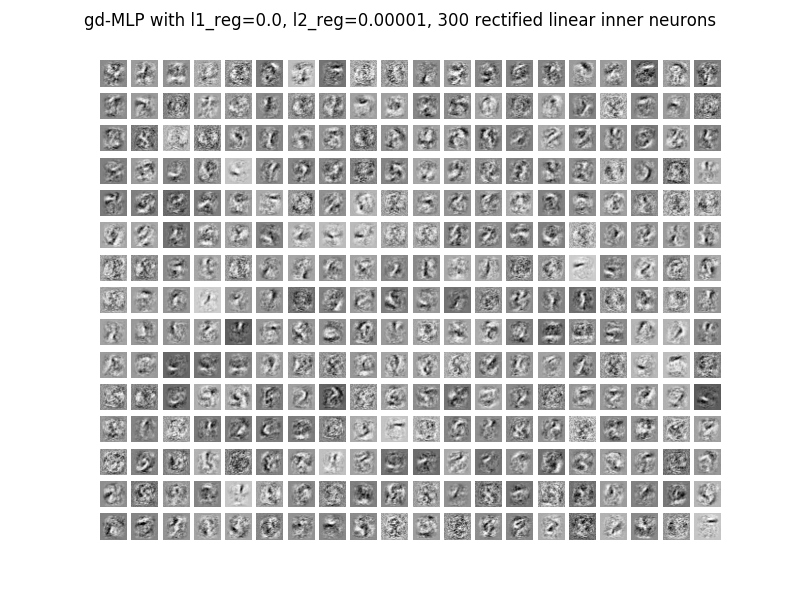

#Multi Layer Perceptron

##Problem 14
The file mlp.py contains an implementation of a neuronal network with one hidden layer, early stopping, regularization and mini-batch minimization with climin for the NMIST dataset. The implementation depends on the file logistic_sgd.py which contains a multiclass logistic regression class analogous the the previous exercise.

Details for an execution can be specified with the parameters of the method test_mlp(learning_rate=0.01, L1_reg=0.00, L2_reg=0.0001, n_epochs=500, dataset='mnist.pkl.gz', batch_size=20, n_hidden=500, optimizer='gd', activation=T.tanh).

learning_rate: Learing rate for optimization with gradient descent
l1_reg, l2_reg: factors for l1 and l2 regularization
n_hidden: number neurons in the hidden layer,
optimizer: name of the climin optimizer, which should be used. E.g: "gd" or "rmsprop"
activation: activation function for the hidden layer.
batch_size: batch size
n_epochs: maximal number of epochs.

##Problem 15

###Weight initialization
For such a neuronal network it is crucial to initialize the weights correctly. With and normal inizialization of all parameters with the call

cli.initialize.randomize_normal(flat, 0, 1)

the neuronal network cannot learn properly and only archieves validation and test errors of over 5%. An error plot of such a run is in the subfolder "Visualizations Problem 15".

  

However, if the weights are initialized with an uniformal distribution as described in the Y. Bengio, X. Glorot, Understanding the difficulty of training deep feedforward neuralnetworks, AISTATS 2010, the MLP performs greatly. The following plot shows the error rates for such an execution and no regularization. Here, a validation error of 1.7% and a test error of 1.84% could be achieved.

  

###Regularization
To prevent the mlp from overfitting, regularization can be introduced. The subfolder "Visualizations Problem 15" contains several error plots of executions with L1 and L2 regularisation terms of 1,  0.01, 0.001, 0,0001 and 0.00001. A summary of the results of this executions is given here.

For all regularization terms, L2 regularization performed better than L1 regularization. Furthermore it could be overserved, that for the classification of MNIST data very small regularization factors are effective. Only with L2 regularization of 0.00001, better result compared to no regularization could be achieved.

However, if a suitable regularization factor is found, the mlp produces significantly better results (here L2 regularization = 0.00001):

Best validation score of 1.570000 % with test performance 1.640000 %

An error plot is given below in problem 17. An exacter specification of the optimal regularisation factor is difficult because the results of two executions always vary up to some extend due to the random batches.

###Optimization method
Comparing different optimizations methods yields mainly differences in the execution time. Gradient descent needs on my laptop approximately 13 seconds per epoch, rmsprop in contrast 24 seconds. Achieving best validation scores of 1.64% with test performances 1.75%, rmsprop performs slightly worse than gradient descent.  Since that, gradient descent as the faster and more accurate option is used in the following. An error plot of an execution with rmsprop is also included in the folder "Visualizations Problem 15".

  

###Execution time
Suitable regularization the execution leads to a more constant optimization process. The main part of the minimization still is done in the first epochs, but can be continued longer. Thus, execution imes of runs with regularization run usually longer than without. This can also be observed in the error plots above. Often with regularization the maximal number of epochs is reached before the early stopping mechanism is activated and stops the execution. 

#Problem 16
The weight initialization for the tanh and sigmoid functions is done according to Y. Bengio, X. Glorot, Understanding the difficulty of training deep feedforward neuralnetworks, AISTATS 2010. Being similarly shaped as a tanh, the retified linear unit weights are initialized the same as in the run with tanh activation functions. Results for execution with different activation functions are in the following table:

| activation function    | best validation score         | test error        |
|------------------------|-------------------------------|-------------------|
| tanh                   | 1.570000 %                    | 1.640000 %        |
| sigmoid                | 1.480000 %                    | 1.660000 %        |
| rectified linear units | 1.490000 %                    | 1.630000 %        |

As it can be seen, the three kinds of activation functions perform similarly well. Apart from small variation due to the random minibatches they all produce similar error plots and final validation errors of around 1.54% and test errors about 1.64% (error plots are below in problem 17). Also the respective fields (visualised in problem 18) seem similar showing the different features the individual neurons focus on.

Comparing the function yiels differences in the images of the function. Tanh has an image of [-1,1] and is flater than the sigmoid function. The sigmoid function as well as rectified linear units only outputs values in the interval [0,1]. Another important difference is that sigmoid functions only output 0 for x-> -infinity, tanh for x=0 and rectified linear units for x>= 0. Nevertheless, the mlp can adopt to all this activation function and produce similar good results despite of their differences.

##Problem 17
The files error_tanh.png, error_sigmoid.png, and error_relu.png contain error plots of execution with different activation functions.

  
  
  

##Problem 18
The files repflds_tanh.png, repflds_sigmoid.png, and repflds_relu.png contain visualizations of the weights of the 300 hidden units of executions with tanh, sigmoid and rectified liear neurons.

  
  
  

##Problem 19

By initializing the weights optimal, the achieved error rate can be reduced to less than 2%. With regularization, the error rates even drop under 1.7%. Concrete executions with such results are given above in the capters of problem 15 and 16. Adjusting the weights manually is not sensefull and bad scientific practise as already described in the logreg chapter.